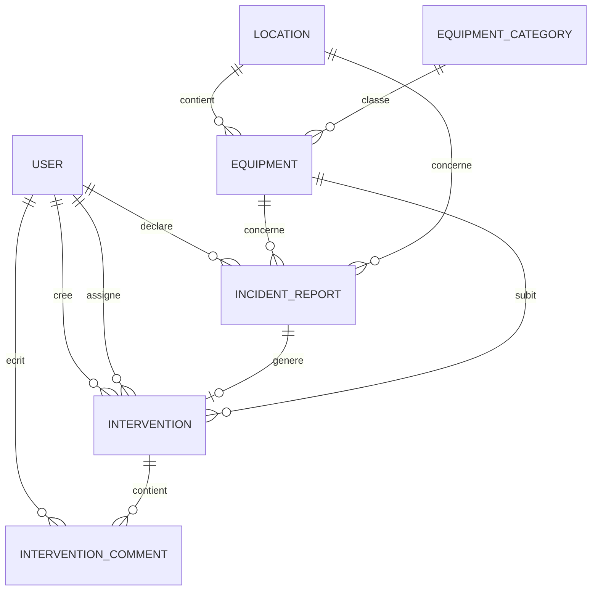

# Documentation fonctionnelle et modele de donnees

## 1. Contexte
Cette plateforme centralise la gestion des equipements, des emplacements (salles, bureaux, laboratoires, zones) et des interventions techniques.

Objectifs principaux :
- Suivre l'inventaire materiel.
- Declarer et traiter les pannes.
- Affecter les interventions aux techniciens.
- Conserver un historique fiable des actions.
- Visualiser l'etat global via un tableau de bord.

## 2. Acteurs
- Utilisateur simple : declare des problemes.
- Technicien : traite les interventions qui lui sont affectees.
- Administrateur / Responsable technique : gere l'inventaire, les emplacements et les operations sensibles (suppression, modifications majeures).

## 3. Fonctionnalites attendues
- Gestion des equipements : creation, consultation, modification, suppression (role admin/responsable).
- Gestion des emplacements : creation et consultation des equipements associes.
- Declaration de panne : sur un equipement existant ou directement sur un emplacement.
- Cycle de vie des interventions : creee, assignee, en cours, resolue, annulee.
- Historique : interventions par equipement, technicien, date et actions realisees.
- Tableau de bord : statistiques globales et indicateurs de criticite.

## 4. Modeles (entites)

### 4.1 User
Represente les utilisateurs de la plateforme.

Attributs proposes :
- id (Long)
- nom (String)
- email (String, unique)
- motDePasseHash (String)
- role (Enum: USER, TECHNICIAN, ADMIN, MANAGER)
- actif (boolean)
- createdAt (LocalDateTime)
- updatedAt (LocalDateTime)

### 4.2 Location
Represente un emplacement physique (salle, bureau, laboratoire, zone).

Attributs proposes :
- id (Long)
- nom (String)
- type (Enum: SALLE, BUREAU, LABORATOIRE, ZONE)
- localisation (String)
- description (String, optionnel)
- createdAt (LocalDateTime)
- updatedAt (LocalDateTime)

### 4.3 EquipmentCategory
Categorie d'equipement (ordinateur, imprimante, routeur, etc.).

Attributs proposes :
- id (Long)
- nom (String, unique)
- description (String, optionnel)

### 4.4 Equipment
Represente un equipement de l'inventaire.

Attributs proposes :
- id (Long)
- nom (String)
- reference (String, unique)
- etat (Enum: FUNCTIONAL, BROKEN, MAINTENANCE, OUT_OF_SERVICE)
- dateAcquisition (LocalDate)
- photoUrl (String, optionnel)
- descriptionTechnique (String, optionnel)
- serialNumber (String, optionnel)
- createdAt (LocalDateTime)
- updatedAt (LocalDateTime)

### 4.5 IncidentReport
Declaration initiale d'un probleme.

Attributs proposes :
- id (Long)
- descriptionPanne (String)
- imageUrl (String, optionnel)
- urgence (Enum: LOW, MEDIUM, HIGH, CRITICAL)
- statut (Enum: OPEN, CONVERTED_TO_INTERVENTION, CANCELED)
- declaredAt (LocalDateTime)

Cas couverts :
- lie a un equipement connu
- lie directement a un emplacement si l'equipement est inconnu

### 4.6 Intervention
Ticket technique traite par un technicien.

Attributs proposes :
- id (Long)
- titre (String)
- description (String)
- statut (Enum: CREATED, ASSIGNED, IN_PROGRESS, RESOLVED, CANCELED)
- urgence (Enum: LOW, MEDIUM, HIGH, CRITICAL)
- resolutionCommentaire (String, requis pour RESOLVED)
- actionsRealisees (String, optionnel)
- createdAt (LocalDateTime)
- assignedAt (LocalDateTime, optionnel)
- startedAt (LocalDateTime, optionnel)
- resolvedAt (LocalDateTime, optionnel)
- canceledAt (LocalDateTime, optionnel)

### 4.7 InterventionComment
Commentaires de suivi sur une intervention.

Attributs proposes :
- id (Long)
- commentaire (String)
- createdAt (LocalDateTime)

## 5. Relations entre modeles

- Un Location possede plusieurs Equipment.
- Un Equipment appartient a un seul Location.
- Un Equipment appartient a une seule EquipmentCategory.
- Une EquipmentCategory regroupe plusieurs Equipment.
- Un User (role USER) peut creer plusieurs IncidentReport.
- Un IncidentReport peut cibler un Equipment (optionnel) ou un Location (optionnel), au moins un des deux est obligatoire.
- Un IncidentReport peut donner lieu a une Intervention.
- Un Equipment peut avoir plusieurs Intervention.
- Un User (role TECHNICIAN) peut etre assigne a plusieurs Intervention.
- Une Intervention possede plusieurs InterventionComment.
- Une Intervention est creee par un User (declarant/admin) et eventuellement assignee a un User technicien.

## 6. Cardinalites (resume)
- Location 1 --- N Equipment
- EquipmentCategory 1 --- N Equipment
- User 1 --- N IncidentReport (declarePar)
- Equipment 1 --- N IncidentReport (si incident cible un equipement)
- Location 1 --- N IncidentReport (si incident cible un emplacement)
- IncidentReport 1 --- 0..1 Intervention
- Equipment 1 --- N Intervention
- User(technicien) 1 --- N Intervention (assigneeA)
- Intervention 1 --- N InterventionComment
- User 1 --- N InterventionComment (auteur)

## 7. Diagramme relationnel (vue metier)

## 8. Regles metier
- Un equipement doit appartenir a un emplacement precis.
- Une intervention ne peut pas passer a RESOLVED sans resolutionCommentaire.
- Un technicien ne peut modifier que les interventions qui lui sont affectees.
- Un utilisateur simple peut declarer un probleme, mais ne peut pas modifier l'etat final d'un equipement.
- Seul un administrateur/responsable peut supprimer un equipement ou modifier les informations critiques de l'inventaire.
- Si une intervention est resolue et qu'aucune contre-indication n'est specifiee, l'equipement peut revenir a l'etat FUNCTIONAL.

## 9. Indicateurs tableau de bord
- Nombre total d'equipements.
- Nombre d'equipements par etat : FUNCTIONAL, BROKEN, MAINTENANCE, OUT_OF_SERVICE.
- Nombre d'interventions par statut : CREATED, IN_PROGRESS, RESOLVED, CANCELED.
- Top equipements les plus en panne.
- Top emplacements avec le plus de problemes signales.

## 10. Contraintes techniques et evolutions
Contraintes :
- Authentification et gestion des roles.
- Donnees coherentes et anti-doublons (reference equipement unique, email unique).
- Tracabilite complete (horodatage + historique).

Evolutions possibles :
- QR code pour identification des equipements.
- Notifications automatiques.
- Export PDF des fiches equipements et interventions.
- Application mobile pour techniciens.
